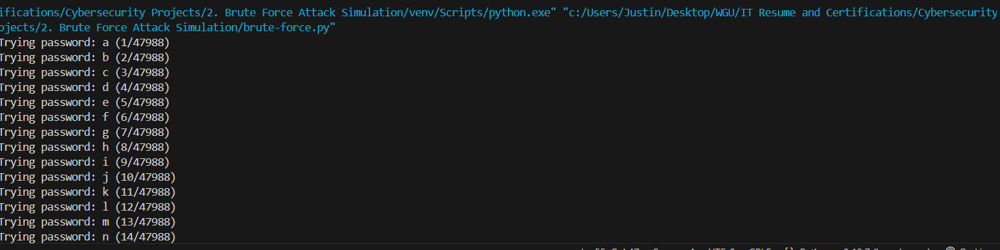

# Brute Force Attack Simulation

## Overview
This project is a Python-based brute force attack simulation that demonstrates how brute force attacks work. The script attempts to guess passwords by hashing and comparing them to a stored hash.

## Screenshots
Here are some screenshots of the project in action:




## Features
- Simulates brute force attacks with customizable character sets and password lengths.
- Includes rate-limiting to mimic real-world security measures.
- Generates a report after the attack, detailing the time taken and number of guesses made.

## Requirements
- Python 3.x
- Libraries: `hashlib`, `itertools`, `string`, `time`

## How to Run
1. Clone this repository:
   ```bash
   git clone https://github.com/JustinRLew/Brute-Force-Attack-Simulation.git

Navigate into the project directory:

bash
cd Brute-Force-Attack-Simulation
Set up a virtual environment:

bash
python -m venv venv
Activate the virtual environment:

On Windows:
bash
venv\Scripts\activate

On macOS/Linux:
bash
source venv/bin/activate

Run the brute force attack script:
bash
python brute_force.py
